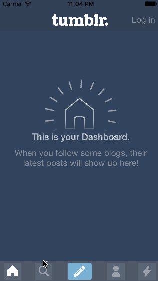

# CodePath Week 4 homework - Tumblr 

This project submission is CodePath's week 4 homework of Tumblr by Kevin Zhu

Time spent: 6 hours spent in total

 Completed project requirements:

Setup
 * [x] Create a new project (disable Auto Layout).
 * [x] Add the image assets above.
 * [x] Configure the app icon and splash screen.

Create initial TabBarViewController view
 * [x] Add a view that is 44 pts tall for the tab bar and choose the color.
 * [x] Add 5 buttons for Home, Search, Compose, Account, and Trending. Be sure to configure them as custom buttons with images for the default and selected state.
 * [x] Add a view for the content above the tab bar. Create an outlet for it called contentView.

Create initial HomeViewController view
 * [x] Add 3 image views for the background, text, and spinner.
 * [x] Create the HomeViewController class.

Create initial SearchViewController
 * [x] Add image view for the search feed.
 * [x] Create the SearchViewController class.

Create initial ComposeViewController view
 * [x] Set the background color of the view to be a blue with some transparency.
 * [x] Add 6 custom buttons with the compose button images.
 * [x] Add a Nevermind button at the bottom of the view.
 * [x] Create the ComposeViewController class.

Create initial AccountViewController view
 * [x] Add image view for the account view.
 * [x] Create the AccountViewController class.

Create initial TrendingViewController view
 * [x] Add scroll view with embedded image view.
 * [x] Create the TrendingViewController class.
 * [x] Create outlets for the scroll view and image view and set the content size of the scroll view.

Implement TabBarViewController behavior
 * [x] Connect the tab bar buttons to a shared action function. In that function, add the view of the selected view controller to the contentView.
 * [x] It's useful to track what the currently selected button and view controller is in a property, so you can unselect the button or remove the view controller's view when another button is selected.

Compose Buttons Transition
 * [x] The compose button should modally segue to the ComposeViewController.

Compose Button Animations
 * [x] Add a viewWillAppear method to the ComposeViewController. Within the viewWillAppear method, set the initial positions of the compose buttons to below the screen.
 * [x] Add a viewDidAppear method. Within the viewDidAppear method, schedule the animations of the compose buttons.
 * [x] Tapping the "Nevermind" button should dismiss the ComposeViewController.
 * [x] Optional: Create a Custom Modal Transition so the Compose screen fades in.

Login
 * [x] Display the login form in a modal segue.
 * [x] Optional: Create a Custom Transition to fade in the login screen.

Bobbing Discover Bubble
 * [ ] Optional: Add an image view to the custom tab bar controller. When the appropriate button is selected, hide the bubble. Otherwise, show it.

Loading
 * [ ] Optional: Show the custom loading indicator by playing the sequence of pngs.
   * [ ] Add a viewWillAppear method to the searchViewController. Within the viewWillAppear method, hide the background image feed and show the custom loading indicator.
   * [ ] Add a viewDidAppear method to the searchViewController. Within the viewDidAppear method, add a delay method. In the completion block of the delay, hide the custom loading indicator and show the background image feed.

 
Notes:
Could not figure out how to make the view transparent after the segue. That is all that's needed to make this work perfectly. Fading works but once the segue is complete the background is solid. Tried to set alpha to <1 but did not work. 

GIF created with [LiceCap](http://www.cockos.com/licecap/).
